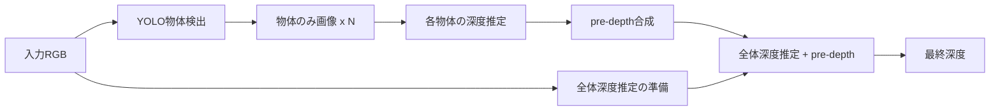

# 物体 pre-depth 研究: 実装計画

作成日: 2026-07-10
研究方針（ユーザー記述）に基づく。`main` ブランチの現状コードとのギャップ分析を含む。

---

## 研究方針（整理）

| 項目 | 内容 |
|------|------|
| **目的** | 物体の細部表現を向上させる |
| **手段** | YOLO 等の物体検出モデルで物体領域を特定し、そこから得た深度を追加情報として使う |
| **Step 1** | 画像内の物体検出 → 家具など**物体のみの画像**を生成 |
| **Step 2** | 物体のみの画像で深度推定 → **pre-depth 画像**を生成 |
| **Step 3** | pre-depth を全体画像の深度推定時の**追加情報**として使用 |



---

## 前回実験からの教訓（参考）

`docs/pre_depth_improvement_plan.md` および削除前のフェーズ1/2結果より:

| 教訓 | 本計画への反映 |
|------|----------------|
| バイナリマスクのみの Early Fusion は効かない | マスクではなく**深度値 (pre-depth)** を渡す |
| クロップ深度はスケール・シフトがバラバラ | 貼り込み前に**最小二乗整合**が必須 |
| 学習時と推論時の pre-depth 作り方の不一致は危険 | 学習も**推論と同じ経路**で擬似 pre-depth を作る |
| NYUv2 全体 abs_rel だけでは物体改善が見えない | **ROI / 境界帯**の領域別評価を必須にする |
| 公式重みからの長期 fine-tune は汎化を壊しやすい | 早期停止・凍結・軽量アダプタを検討 |

---

## main ブランチの現状（2026-07-10 時点）

### あるもの（再利用可）

| カテゴリ | ファイル | 使える機能 |
|----------|----------|------------|
| 深度推論 | `pipeline.py` (`LotusDPipeline`) | 1-step 回帰、768px 処理、depth 出力 |
| バッチ推論 | `infer.py` | 画像フォルダ → `.npy` + 可視化 |
| 学習 | `train_lotus_d.py` | Hypersim/VKITTI、trunc_disparity 正規化 |
| データ | `utils/hypersim_dataset.py`, `utils/vkitti_dataset.py` | GT 深度・マスク |
| 評価 | `eval.py`, `evaluation/evaluation.py` | NYUv2 等ベンチマーク、abs_rel/delta1 |
| 深度整合 | `evaluation/util/alignment.py` | disparity 空間の最小二乗合わせ（**評価用**） |
| 画像処理 | `utils/image_utils.py` | `resize_max_res`, `resize_back`, `colorize_depth_map` |
| 計画・知見 | `docs/pre_depth_improvement_plan.md` | 設計上の注意点 |

### ないもの（新規実装が必要）

| カテゴリ | 欠落しているもの |
|----------|------------------|
| 物体検出 | YOLO 連携、`ultralytics` 依存、マスク生成 |
| 物体切り出し | 物体のみ画像の生成ロジック |
| pre-depth 合成 | global + 物体深度の整合・貼り込み |
| pre-depth 注入 | `pipeline.py` への追加入力、`UNet conv_in` 拡張 |
| 推論パイプライン | 3 ステップを一括実行する CLI |
| 領域別評価 | ROI / 境界帯 abs_rel、boundary F-score |
| 学習時合成 | 推論経路と一致する擬似 pre-depth 生成 |

### main の Lotus-D パイプライン制約

- 入力: **RGB のみ**（`rgb_in` + `task_emb`）
- UNet `conv_in`: **4ch**（RGB latent）
- pre-depth / マスク / ROI 引数なし
- `infer.py` は 1 画像 1 推論の単純ループ

---

## 研究方針と旧計画の差分

| 観点 | ユーザー研究方針 | 旧 `pre_depth_implementation_plan.md` |
|------|------------------|----------------------------------------|
| Step 1 の出力 | **物体のみの画像**を明示 | bbox クロップ（背景込み）が中心 |
| Step 2 | 物体画像 → pre-depth | global + crop 融合 → pre-depth |
| Step 3 | 追加情報として全体推定 | 潜在空間注入（学習込み） |
| 物体画像の定義 | 要設計（下記） | マスク付き crop または fusion 深度 |

**設計上の最初の決定事項**: 「物体のみの画像」の具体形

| 方式 | 説明 | メリット | デメリット |
|------|------|----------|------------|
| **A. bbox crop + 余白** | 検出框を 25% 拡張して切り出し（背景あり） | Lotus が文脈を使える、実装簡単 | 「物体のみ」ではない |
| **B. マスク外を無効化** | bbox 内でマスク外を黒/グレー埋め | 物体に集中、方針に近い | 深度モデルが埋め草に惑わされる可能性 |
| **C. マスク外をインペイント** | 背景をぼかし/平均色で埋める | 見た目は自然 | 実装コスト高、ノイズ源になりうる |

**推奨**: まず **A（bbox + 25% 余白）** で実装し、**B** を ablation。前回フェーズ1で「余白なし crop は精度低下」と確認済み。

---

## 実装計画

### フェーズ 0: 設計固定（1日）

- [ ] 「物体のみ画像」= 方式 A を既定、B を `--object_image_mode {crop,masked}` で切替
- [ ] pre-depth = 物体深度を global に lstsq 整合して貼った disparity マップ（旧 Step 1 合成と同型）
- [ ] 注入方式 = **潜在空間連結 + ゼロ初期化**（旧計画 Step 2 を踏襲。Early Fusion は不採用）
- [ ] 成功指標: 公式 Lotus-D の**全体 abs_rel を悪化させず**、**ROI abs_rel / boundary F1** が改善

---

### フェーズ 1: 学習不要パイプライン（1〜2週間）

**目的**: 研究方針 Step 1〜2 を実装し、Step 3 を**後処理 fusion**（学習なし）で試す。方式の上限を見積もる。

#### 1-1. 物体検出・物体のみ画像生成

| タスク | 新規ファイル | 内容 |
|--------|-------------|------|
| YOLO マスク生成 | `utils/generate_semantic_masks.py` | YOLOv8-seg で NYUv2/Hypersim 用マスク一括生成 |
| マスクユーティリティ | `utils/semantic_mask_utils.py` | マスク読込、bbox 抽出、余白付与 |
| 物体画像生成 | `utils/object_image.py` | マスク + bbox → 物体のみ画像（方式 A/B） |

依存追加: `requirements.txt` に `ultralytics` を追加。

#### 1-2. pre-depth 生成（研究方針 Step 2）

| タスク | 新規ファイル | 内容 |
|--------|-------------|------|
| 深度整合 | `utils/depth_alignment.py` | `fit_scale_shift`, `apply_scale_shift`（`evaluation/util/alignment.py` を推論向けに簡略化） |
| ROI 融合 | `utils/roi_fusion.py` | 複数物体深度の lstsq 整合貼り込み → pre-depth |
| 推論 CLI | `infer_object_predepth.py` | 3 ステップ一括: 検出 → 物体深度 → pre-depth 合成 → （オプション）最終深度 |

**推論フロー（フェーズ1版）**:

```
1. global_disp  = LotusD(全体RGB)
2. for each object:
     obj_img    = make_object_image(RGB, mask, bbox)   # Step 1
     obj_disp   = LotusD(obj_img)                      # Step 2（物体のみ）
3. pre_depth    = fuse_roi_depth(global_disp, obj_disps, align=lstsq)
4. final_disp   = pre_depth  # または soft blend（学習なしベースライン）
```

#### 1-3. 評価

| タスク | 新規ファイル | 内容 |
|--------|-------------|------|
| 領域別指標 | `evaluation/roi_depth_metrics.py` | global / ROI / boundary abs_rel |
| 境界 F-score | `utils/boundary_metrics.py` | depth boundary F1 |
| 評価ランナー | `utils/run_phase1_eval.py` | 3 条件比較: global / paste / lstsq |

**比較条件（NYUv2 654枚）**:

| 条件 | 意味 |
|------|------|
| `global` | 公式 Lotus-D、全体推定のみ（ベースライン） |
| `paste` | 物体深度を整合なしで貼る（旧方式、ablation） |
| `lstsq` | 物体深度を整合して pre-depth 化（Step 2 出力をそのまま使う） |

#### 1-4. Go/No-Go 判定

- **Go**: `lstsq` が `global` を ROI・boundary 指標で上回り、全体 abs_rel が大きく悪化しない
- **No-Go**: 前回同様 global が最良 → Step 3（注入）の情報上限が低い。マスク品質・物体画像方式の見直し

---

### フェーズ 2: pre-depth 注入 + 学習（2〜4週間）

**目的**: 研究方針 Step 3 を実装。モデルが pre-depth を**追加情報として読む**ことを学習で獲得する。

#### 2-1. 注入機構（潜在空間）

| タスク | 新規/改修 | 内容 |
|--------|----------|------|
| UNet 拡張 | `utils/pre_depth_fusion.py` | conv_in 4ch → 9ch（pre-depth latent 4ch + mask 1ch）、ゼロ初期化 |
| パイプライン | `pipeline.py` | `LotusDPipeline.__call__` に `pre_depth`, `pre_depth_valid_mask` 追加 |
| 等価性テスト | `utils/check_pre_depth_zero_init.py` | pre-depth なし時に公式と同一出力 |

#### 2-2. 学習時の pre-depth 合成（推論経路と一致させる）

**重要**: 前回失敗の一因は「学習=GT ノイズ、推論=ROI fusion」だった。今回は推論と同型の擬似合成にする。

| タスク | 新規ファイル | 内容 |
|--------|-------------|------|
| 擬似合成 | `utils/pre_depth_synth.py` | GT 深度から物体領域を切り出し、スケールズレ・ぼかし・欠損を付与 |
| 学習データ用マスク | Hypersim GT semantic または YOLO | 学習時の物体領域定義 |
| 学習ループ | `train_lotus_d.py` 改修 | `--enable_pre_depth_fusion`、合成 pre-depth の latent 注入 |
| 勾配損失 | `train_lotus_d.py` | `--grad_loss_weight`（境界シャープさ促進） |

**学習時の擬似 pre-depth 生成（推奨）**:

```
1. GT 深度 + 物体マスク（Hypersim semantic または擬似 bbox）
2. 物体領域の深度を global GT に lstsq 整合（推論と同型）
3. ランダム摂動（スケールズレ、ぼかし、穴あけ）を付与
4. 30% dropout でゼロ化
```

#### 2-3. 学習設定

| 項目 | 値 |
|------|-----|
| 起点 | `jingheya/lotus-depth-d-v2-0-disparity`（公式重み） |
| 精度 | bf16 |
| 早期停止 | NYUv2 監視、500 step 以降悪化なら打ち切り |
| データ | `data/hypersim_processed` |
| スクリプト | `train_scripts/train_lotus_d_pre_depth.ps1` |

#### 2-4. 推論（Step 3 本番）

`infer_object_predepth.py` を拡張:

```
1. YOLO → 物体のみ画像
2. 各物体 + 全体の深度推定 → pre-depth 合成
3. LotusD(全体RGB, pre_depth=合成深度, valid_mask) → 最終深度   # Step 3
```

#### 2-5. 最終評価（3 者比較）

| モデル | 条件 |
|--------|------|
| 公式 Lotus-D | global のみ |
| フェーズ1 lstsq | pre-depth を出力に貼る（学習なし） |
| 学習済み | global（pre-depth なし） vs pre-depth 注入 |

評価ランナー: `utils/run_phase2_eval.py`

---

## ファイル一覧（新規 vs 改修）

### 新規作成

```
utils/generate_semantic_masks.py    # YOLO マスク生成
utils/semantic_mask_utils.py        # マスク・bbox
utils/object_image.py               # 物体のみ画像（★今回の方針の新規要素）
utils/depth_alignment.py            # スケール・シフト整合
utils/roi_fusion.py                 # pre-depth 合成
utils/boundary_metrics.py           # boundary F-score
utils/run_phase1_eval.py            # フェーズ1評価
utils/pre_depth_fusion.py           # UNet 拡張・latent encode
utils/pre_depth_synth.py            # 学習用擬似 pre-depth
utils/check_pre_depth_zero_init.py   # ゼロ初期化テスト
utils/run_phase2_eval.py            # フェーズ2評価
infer_object_predepth.py            # 3ステップ推論 CLI（★メインエントリ）
evaluation/roi_depth_metrics.py     # 領域別評価
train_scripts/train_lotus_d_pre_depth.ps1
docs/phase1_results.md              # 結果記録
```

### 既存改修

```
pipeline.py           # pre_depth 引数、latent 連結
train_lotus_d.py      # 学習ループ、損失、引数
requirements.txt      # ultralytics 追加
```

### そのまま利用（改修不要）

```
infer.py, eval.py, evaluation/evaluation.py
utils/hypersim_dataset.py, utils/image_utils.py
evaluation/util/alignment.py（参考実装）
```

---

## 実施順序

```
フェーズ0  設計固定（物体画像方式、評価指標）
    ↓
フェーズ1  物体検出 → 物体のみ画像 → 物体深度 → pre-depth 合成
           NYUv2 評価 → Go/No-Go
    ↓ (Go の場合)
フェーズ2  潜在空間注入 + ゼロ初期化テスト
           推論同型の擬似 pre-depth で学習
           Step3 推論 + 3者比較評価
```

| 順番 | 作業 | 学習 | 期間目安 |
|------|------|------|----------|
| 1 | `object_image.py` + YOLO マスク | 不要 | 2〜3日 |
| 2 | `depth_alignment.py` + `roi_fusion.py` | 不要 | 1〜2日 |
| 3 | `infer_object_predepth.py`（Step 1〜2） | 不要 | 2〜3日 |
| 4 | フェーズ1評価（NYUv2） | 不要 | 1〜2日 |
| 5 | Go 判定 | — | — |
| 6 | `pre_depth_fusion.py` + `pipeline.py` | 不要 | 2〜3日 |
| 7 | ゼロ初期化等価性テスト | 不要 | 1日 |
| 8 | `pre_depth_synth.py` + 学習ループ | **必要** | 3〜5日 |
| 9 | 本学習 + 早期停止監視 | **必要** | 数日〜 |
| 10 | フェーズ2最終評価 | 不要 | 1日 |

---

## リスクと対策

| リスク | 対策 |
|--------|------|
| YOLO マスク品質が低い | SAM や Hypersim GT semantic でのオラクル ablation |
| 物体のみ画像（方式B）で深度が崩れる | 既定は方式A（bbox+余白）、B は ablation |
| fine-tune で NYUv2 汎化が落ちる | 早期停止、公式重み付近の checkpoint を採用 |
| 学習・推論の pre-depth 不一致 | 推論同型の `pre_depth_synth` を使う |
| 全体指標が物体改善を隠す | ROI / boundary 必須評価 |

---

## 次のアクション

1. **フェーズ 0**: `object_image_mode` の既定を `crop`（bbox+25%余白）に決める
2. **フェーズ 1-1 から着手**: `utils/object_image.py` と YOLO マスク生成
3. 並行して NYUv2 テスト用マスクを `data/nyu_sem_masks/` に生成
