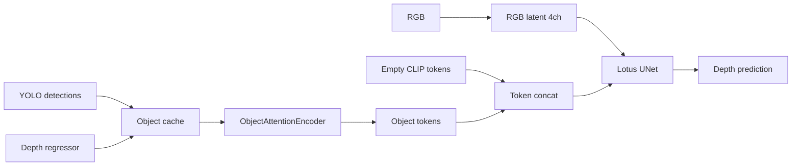

# Regressor Object Attention 実装計画

## 方針

- ベースは公式Lotus-Dの**4ch RGB UNet**。既存の9ch pre-depth入力は使用しない。
- 空promptのCLIP token `[B,77,1024]` に、score上位のobject token `[B,K,1024]` を連結し、既存`UNet2DConditionModel`のcross-attentionへ渡す。
- UNet構造・`cross_attention_dim=1024`は変更せず、`ObjectAttentionEncoder`とUNetを共同fine-tuneする。
- `K=16`、score閾値`0.5`、物体条件dropout`0.2`を初期値とする。padding tokenはattention maskで完全に無視する。

## 実装

1. **再現可能なobject cacheを作る**
   - 新規[`utils/build_object_attention_cache.py`](utils/build_object_attention_cache.py)で、検出JSONと`output/object_depth_regressor_v4_mask`から画像単位のragged cacheを**単一NPZ**へ保存する。
   - 各物体に`class_id`、正規化bbox `(cx,cy,w,h)`、log area/aspect、score、mask形状6特徴、`log(pred_depth_m)`を格納する。
   - cache metadataへRegressor path/schema、score閾値、画像一覧を保存し、Hypersim trainとNYUv2 testを別生成する。GT深度はtokenへ入れず、テスト情報の漏洩を防ぐ。

2. **object token encoderを追加する**
   - 新規[`utils/object_attention_condition.py`](utils/object_attention_condition.py)に`ObjectAttentionEncoder`を実装する。
   - `class embedding + continuous features`をLayerNorm付きMLPで1024次元へ射影する。score順top-16、padding mask、全条件dropoutを共通関数で処理する。
   - diffusersの保存形式に合わせて`ModelMixin/ConfigMixin`化し、`object_condition_encoder/`としてcheckpointへ保存・復元する。

3. **4ch attention-only学習経路を接続する**
   - [`utils/detail_train_dataset.py`](utils/detail_train_dataset.py)でpre-depth成果物を必須にしないattention-only dataset経路を追加し、cacheから`object_class_ids / object_features / object_mask`を返す。
   - [`train_lotus_d.py`](train_lotus_d.py)へ`--enable_object_attention`、cache、max objects、dropout、encoder LRの引数を追加する。
   - empty prompt embeddingへobject tokenをseq方向に連結し、CLIP＋objectのcombined attention maskをUNetへ渡す。UNetとencoderを別LRで共同fine-tuneする。
   - 既存9/12/13ch経路は維持し、attention-only時は`expand_unet_conv_in`を呼ばない。中間checkpointと最終pipelineの両方でencoderを保存する。

4. **推論・評価を同一経路へ統一する**
   - [`pipeline.py`](pipeline.py)の`LotusDPipeline.__call__`にobject ids/features/maskを追加し、学習と同じtoken連結関数を使用する。
   - [`infer_object_depth_regressor.py`](infer_object_depth_regressor.py)ではYOLO→Regressor予測→object featuresを作り、pre-depthではなくattention条件としてpipelineへ渡す。
   - 新規または拡張した[`eval_regressor_predepth_nyuv2.py`](eval_regressor_predepth_nyuv2.py)でNYUv2 cacheを読み、attention ON/OFFを同じcheckpointで評価できるようにする。

5. **テストと比較実験を行う**
   - 新規[`tests/test_object_attention_condition.py`](tests/test_object_attention_condition.py)で、top-K、padding mask、空検出、条件dropout、train/infer token一致、save/loadを検証する。
   - object maskが全falseの場合にobject tokenをappendせず、既存4ch経路と一致することを確認する。
   - NYUv2で以下を比較する: 公式4ch、同stepのRGB-only fine-tune対照、attentionモデルのtoken OFF、attentionモデルのtoken ON。
   - 全体`abs_rel/δ1/RMSE`に加え、YOLO物体ROI指標と物体数別指標を保存し、attention自体の寄与を分離する。

## 主要な注意点

- cross-attention tokenはbbox座標を持つものの、pre-depthのような画素単位の位置合わせはない。精度が不足する場合のみ次段でspatial attention biasを検討する。
- paddingをゼロtokenだけで済ませるとsoftmax確率を奪うため、必ずcombined attention maskを使用する。
- 旧9ch checkpointではなく公式4chから開始し、成果物は別output directoryへ保存する。
