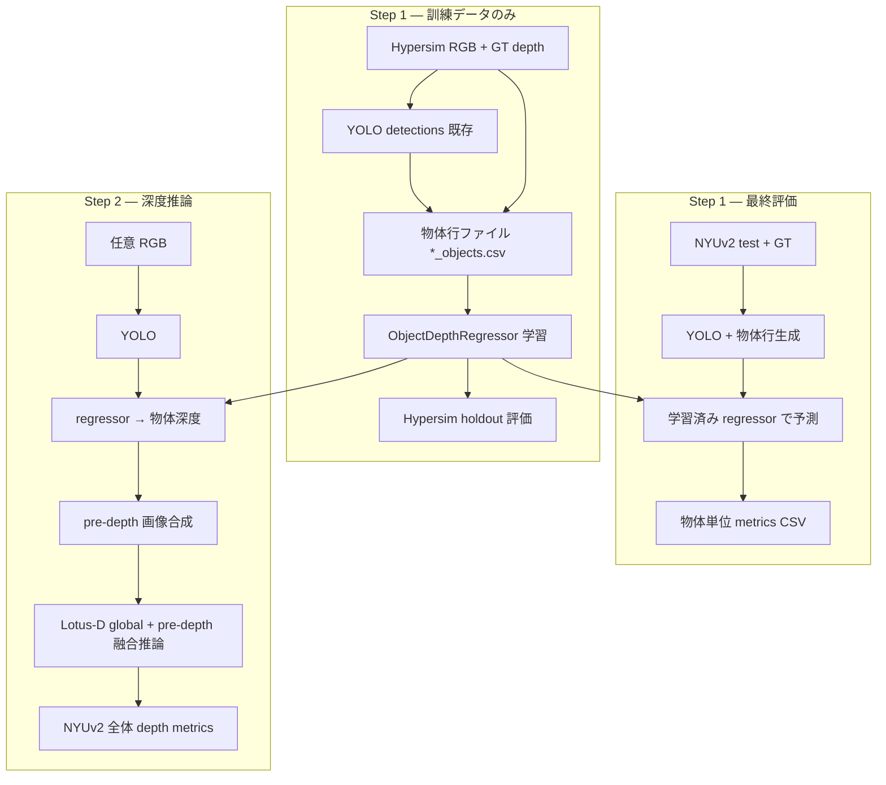

# 実装計画: 物体サイズ→深度リグレッサ + pre-depth 推論

更新日: 2026-07-31  
前提: 既存 Approach A（YOLO → Lotus crop pre-depth → 詳細 UNet）は **別系統として残す**。本計画は **軽量タブラー回帰** で pre-depth を作る新パイプライン。

---

## 0. 目的（ユーザー要件の整理）

| 段階 | 内容 |
|------|------|
| **1. 物体サイズ–深度の学習** | YOLO 検出 → 物体ごとに `(class, bbox_w, bbox_h, depth)` を1行で保存 → **訓練データのみ**で深度予測モデルを学習・評価 |
| **2. 深度予測** | YOLO 検出 → 1 のモデルで物体深度を予測 → pre-depth 画像を構成 → Lotus で最終深度推定 |

**絶対条件:** 段階1の学習・ハイパーパラメータ調整に **テストデータ（NYUv2 test）を一切使わない**。

---

## 1. データ分割（厳守）

```text
┌─────────────────────────────────────────────────────────────┐
│ 訓練データ (Step 1 学習・Step 1 検証のみ)                    │
│   Hypersim train                                            │
│   RGB:  D:/lotus/data/hypersim_processed/train              │
│   GT深:  depth_plane_cam_*.png (同ディレクトリ)              │
│   YOLO:  D:/lotus/data/hypersim_yolo_detections/train       │
│   物体あり: train_manifest_score0.5.json (36,126 枚)         │
├─────────────────────────────────────────────────────────────┤
│ テストデータ (Step 1 最終評価 + Step 2 全体評価のみ)         │
│   NYUv2 test (654 枚)                                       │
│   RGB/GT: datasets/eval/depth/nyuv2/.../test                │
│   成果物: D:/lotus/data/nyuv2_detail_artifacts/test         │
└─────────────────────────────────────────────────────────────┘
```

### 分割ルール

| 用途 | 使ってよいデータ | 使ってはいけないデータ |
|------|------------------|------------------------|
| Step 1 学習 | Hypersim train の物体行 | NYUv2 |
| Step 1 検証（early stop / HP） | Hypersim train の **画像単位 holdout**（例: 5%） | NYUv2 |
| Step 1 最終レポート | NYUv2 test（物体単位 absrel） | 学習・HP 調整には不使用 |
| Step 2 pre-depth 生成 | train / test それぞれ独立に YOLO + 学習済み regressor | — |
| Step 2 深度評価 | NYUv2 test | Hypersim GT を Step 2 の数値比較に混ぜない |

Hypersim に公式 val split が無いため、Step 1 の開発中検証は **Hypersim train 内の image-level holdout** とする（同一画像の物体が train/val に跨らないよう `GroupKFold` 相当）。

---

## 2. 全体パイプライン



---

## 3. Step 1-A: 物体行ファイルの生成

### 3.1 ファイル形式

画像1枚につき1ファイル。既存 `*_detections.json` と同じディレクトリ階層。

```text
{detail_root}/{scene}/rgb_cam_XXXX_objects.csv
```

**CSV ヘッダ（1行 = 1物体）:**

| 列 | 型 | 説明 |
|----|-----|------|
| `class_id` | int | COCO class id |
| `class_name` | str | クラス名 |
| `bbox_w` | float | `(x2-x1) / image_w` |
| `bbox_h` | float | `(y2-y1) / image_h` |
| `depth_gt_m` | float | bbox 内 GT 深度中央値 [m] |
| `disparity_gt` | float | GT から換算した disparity（Lotus 正規化前） |
| `score` | float | YOLO score |
| `x1,y1,x2,y2` | int | 任意（デバッグ用） |

- GT 深度: `depth_plane_cam_*.png` を読み、bbox 内の **有限ピクセル中央値**
- 有効ピクセルが 16 未満の行はスキップ
- 既存 `detection_score_thr=0.5` を既定（学習時と揃える）

### 3.2 実装

| ファイル | 役割 |
|----------|------|
| `utils/object_depth_record.py` | GT 抽出・CSV 読み書き・行→特徴量 |
| `utils/build_object_depth_records.py` | Hypersim / NYUv2 一括生成 CLI |
| `train_scripts/build_object_depth_records_hypersim.ps1` | train 用 |
| `train_scripts/build_object_depth_records_nyuv2.ps1` | test 用（評価専用・学習禁止） |

**入力:** 既存 `*_detections.json` + RGB 対応 GT depth  
**出力:** `*_objects.csv`  
**再実行:** `--skip_existing`

---

## 4. Step 1-B: 深度リグレッサの学習

### 4.1 採用モデル（初期案）

手法は自由とのことなので、**実装コストと解釈性**のバランスで以下を採用:

```text
入力 x = [class_id (embedding), bbox_w, bbox_h, bbox_area, bbox_cy_norm]
出力 y = log(depth_gt_m)   # または disparity_gt
モデル = 2-layer MLP (128→64→1) + Dropout
```

**ベースライン（比較用）:**

1. **Global median** — クラス無視の全体中央値
2. **Per-class median** — クラス別中央値（非パラメトリック）
3. **Linear** — `(w, h, class one-hot)` の Ridge 回帰

Step 1 の「学習」は MLP を主、ベースライン3種は同一評価プロトコルで比較。

### 4.2 学習設定

| 項目 | 値 |
|------|-----|
| データ | Hypersim train manifest 内の `*_objects.csv` 全行 |
| 分割 | image-level 95/5（seed=42、`rgb_path` でグループ） |
| Loss | L1 on `log(depth)` |
| Optimizer | AdamW, lr=1e-3 |
| Epochs | 50（early stop on val L1） |
| Batch | 4096 行（タブラー） |
| 正規化 | `bbox_w/h` は既に [0,1] |

### 4.3 実装

| ファイル | 役割 |
|----------|------|
| `utils/object_depth_regressor.py` | Dataset / MLP / 保存・読込 |
| `train_object_depth_regressor.py` | 学習 CLI（**Hypersim のみ** `--allow_nyuv2` フラグなし） |
| `eval_object_depth_regressor.py` | 物体単位評価 CLI |
| `train_scripts/train_object_depth_regressor.ps1` | 起動 |
| `output/object_depth_regressor/` | 重み + `config.json` + `metrics.json` |

### 4.4 Step 1 評価（必須）

**A. 開発中（Hypersim holdout 5%）**

- 物体単位: abs_rel, RMSE, δ1（depth [m]）
- クラス別 breakdown CSV

**B. 最終（NYUv2 test — 学習後1回）**

- 同上。`build_object_depth_records_nyuv2.ps1` で GT 付き行を生成し、**予測のみ** regressor 実行
- レポート: `output/object_depth_regressor/eval_nyuv2_test/`

**成功基準（案）**

- MLP が per-class median を **abs_rel で 10% 以上改善**
- NYUv2 test でも holdout と同程度の順位関係（大幅な train-test 乖離が無い）

---

## 5. Step 2: regressor 由来 pre-depth → Lotus 深度推論

### 5.1 pre-depth 合成方針

既存 `CoreDepthPredictor.build_pre_depth` の **crop Lotus 推定を regressor 定数深度に置換**:

```text
1. global_depth = Lotus-D(RGB)           # 既存
2. 各 detection について:
     d_obj = regressor(class, w, h)       # meters → disparity に変換
     bbox 内を d_obj の定数 disparity で塗る
3. lstsq で global_depth にスケール整合   # utils/depth_alignment.py 流用
4. pre_depth_norm = disparity_pred_to_norm(fused)
5. valid_mask = bbox  union
```

- 複数 bbox 重なり: score 優先 winner（`object_size_condition.py` と同ロジック）
- global 深度が無い場合のフォールバック: regressor 深度のみ（非推奨、通常は global 必須）

### 5.2 最終深度推論

| 方式 | 説明 |
|------|------|
| **2a. 公式 Lotus + pre-depth 注入** | 9ch 詳細モデル未使用。`pipeline.py` の `pre_depth` 引数 + 公式 UNet（4ch は pre-depth 無視）→ **不可**。公式 4ch は pre-depth 非対応 |
| **2b. 9ch/12ch 詳細モデル + regressor pre-depth** | 学習済み detail UNet に regressor pre-depth を渡す（本計画の主評価） |
| **2c. global のみ（比較）** | pre-depth なし baseline |

→ Step 2 の主比较は **2b vs 2c**（NYUv2 test、least-square disparity 整合）。

### 5.3 実装

| ファイル | 役割 |
|----------|------|
| `utils/object_pre_depth_regressor.py` | regressor → pre_depth / valid_mask 合成 |
| `build_pre_depth_from_regressor.py` | オフライン一括生成（NYUv2 test 等） |
| `infer_object_depth_regressor.py` | RGB → YOLO → regressor pre-depth → Lotus 推論 |
| `eval_regressor_predepth_nyuv2.py` | NYUv2 654 枚 全体 metrics |
| `train_scripts/eval_regressor_predepth_nyuv2.ps1` | 起動 |

### 5.4 Step 2 評価

| 条件 | pre-depth ソース | モデル |
|------|------------------|--------|
| baseline | なし | 公式 Lotus-D |
| Approach A | Lotus crop 融合 | 9ch/12ch detail |
| **本計画** | regressor 定数塗り | 9ch detail（初期） |

指標: 全体 abs_rel / δ1（既存 `eval_detail_conditioned_nyuv2.py` プロトコル踏襲）  
追加: ROI abs_rel（検出 bbox 内のみ）

---

## 6. 実装順序（タスク分解）

### Phase 0 — 土台（1日）

- [x] `utils/object_depth_record.py`
- [x] `utils/build_object_depth_records.py` + Hypersim / NYUv2 ps1
- [ ] Hypersim train 全物体行生成（manifest 36k 枚）— **実行中**

### Phase 1 — Step 1（1–2日）

- [x] `utils/object_depth_regressor.py`
- [x] `train_object_depth_regressor.py`（Hypersim only ガード付き）
- [x] `eval_object_depth_regressor.py`
- [ ] Hypersim holdout 評価 + NYUv2 test 最終評価（全データ学習後に再実行）
- [x] 結果を `output/object_depth_regressor/metrics.json` に保存（→ `metrics_hypersim_holdout.json`）

### Phase 2 — Step 2（1–2日）

- [x] `utils/object_pre_depth_regressor.py`
- [x] `infer_object_depth_regressor.py`
- [x] `eval_regressor_predepth_nyuv2.py`
- [ ] NYUv2: baseline / Approach A / regressor pre-depth 3条件比較

### Phase 3 — ドキュメント

- [ ] `docs/detail_training_runs.md` に Run D として追記
- [ ] 本ファイルのチェックリスト更新

---

## 7. データリーク防止チェックリスト

コードレビュー時に必ず確認:

- [ ] `train_object_depth_regressor.py` が NYUv2 パスを受け取ったら **即エラー**
- [ ] NYUv2 物体行 CSV は `nyuv2_detail_artifacts/test/` のみに出力（train ディレクトリと物理分離）
- [ ] regressor の `config.json` に `train_data_source=hypersim_train` を記録
- [ ] Step 2 評価スクリプトは regressor 重みを読むだけ（fine-tune しない）
- [ ] ログに使用データセット名を明示

---

## 8. 既存コードとの関係

| 既存 | 本計画での扱い |
|------|----------------|
| `*_detections.json` | **再利用**（YOLO 再実行不要） |
| `CoreDepthPredictor.build_pre_depth` | crop 版は残す。regressor 版を **別関数** で追加 |
| `train_lotus_d.py` / 12ch UNet | Step 2 では **推論のみ**（再学習は別 experiment） |
| `filter_detail_train_manifest.py` | Step 1 学習データ絞り込みに **再利用** |

---

## 9. リスクと対策

| リスク | 対策 |
|--------|------|
| bbox 内 GT 深度が背景混入 | 中央値 + 有効ピクセル数閾値。将来 seg マスクで改善 |
| クラス×サイズだけでは深度が決まらない | `bbox_cy`（画面内位置）を特徴に追加。改善しなければ Step 2 効果も限定的 |
| regressor pre-depth が粗すぎる | lstsq 整合 + 9ch UNet が補正。ダメなら Approach A と ensemble |
| Hypersim→NYUv2 ドメインギャップ | Step 1 評価で事前に確認。per-class median baseline との差を見る |

---

## 10. 成果物パス（予定）

```text
D:/lotus/data/hypersim_yolo_detections/train/**/**_objects.csv
D:/lotus/data/nyuv2_detail_artifacts/test/**/**_objects.csv

output/object_depth_regressor/
  model.pt
  config.json
  metrics_hypersim_holdout.json
  eval_nyuv2_test/
    object_metrics.csv
    summary.json

output/eval_regressor_predepth_nyuv2/
  eval_metrics-least_square_disparity.txt
```

---

## 11. 一言サマリ

> YOLO 物体を `(class, w, h) → depth` のタブラー回帰で学習（**Hypersim train のみ**）。NYUv2 は Step 1 最終評価と Step 2 のみ。予測深度で pre-depth を構成し、既存 Lotus 詳細モデルに渡して NYUv2 全体精度を測る。
